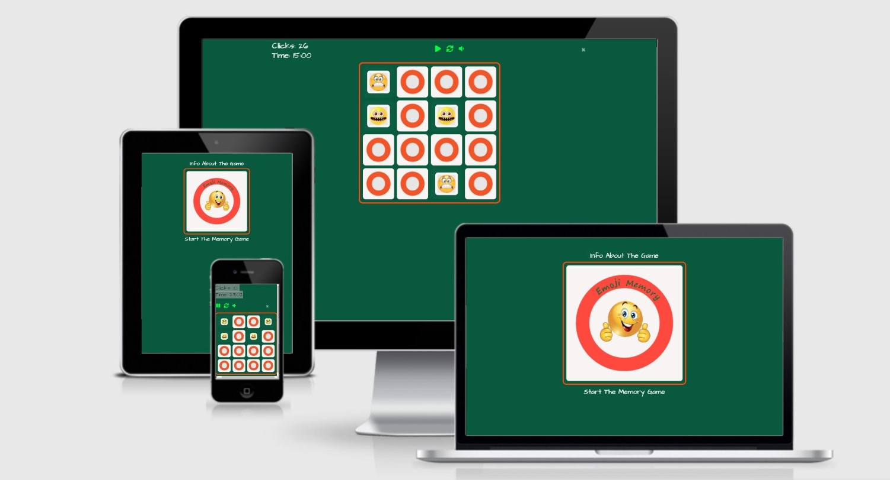
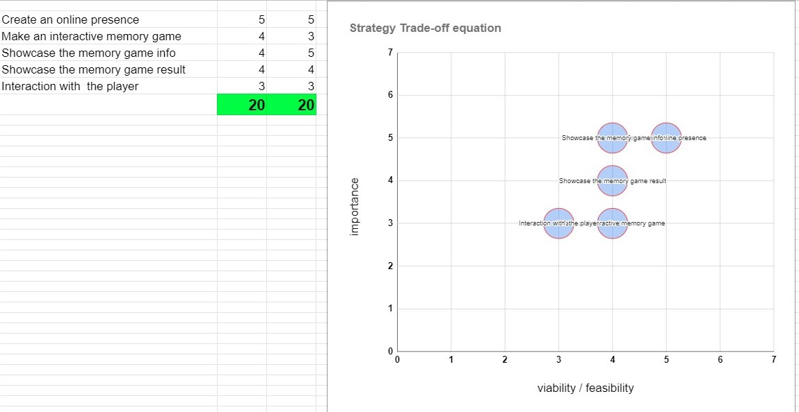
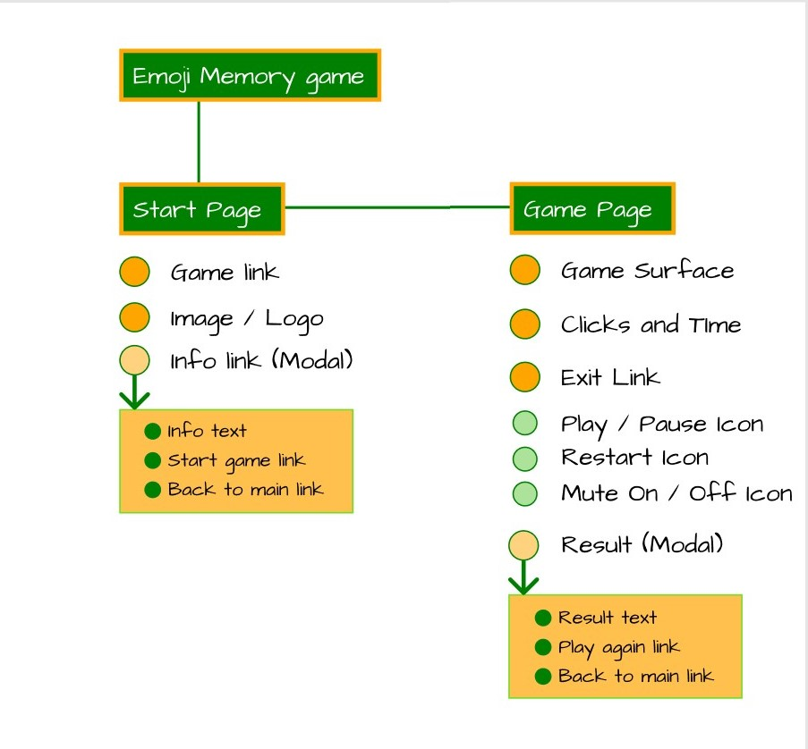
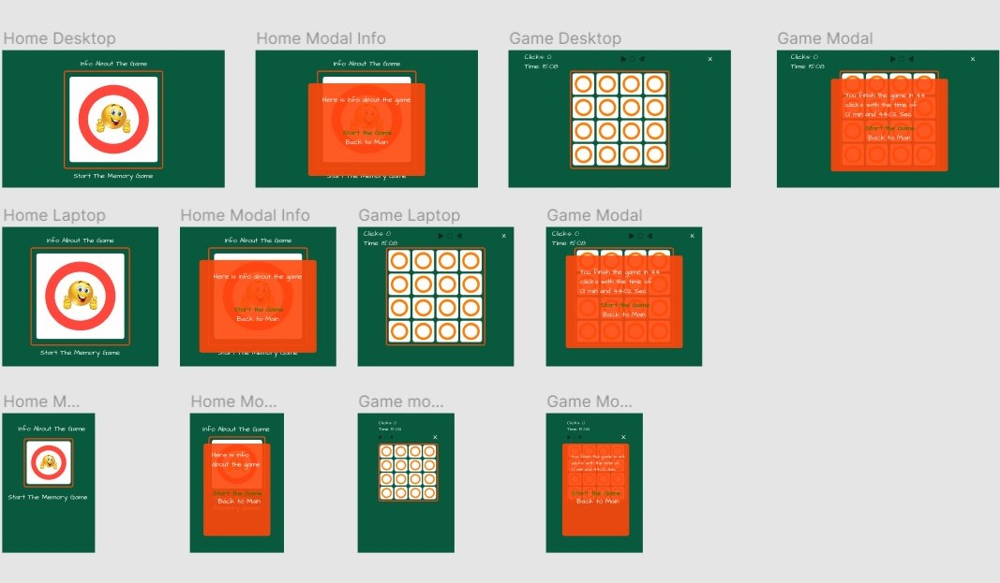

# Memory, The Classic Single Game




## Milestone project 2 (Code Institute)

This is a simple website where you can play the classic game of memory.

**[Check out the website here](https://manell0.github.io/MileStone-2-emoji-memory/index.html)**

## Table of contents

1. [Introduction](#introduction)
2. [UX](#ux)
   1. [Ideal User Demographic](#Ideal-User-Demographic)
   2. [User Stories](#User-Stories)
   3. [Development Planes](#Development-Planes)
   4. [Design](#Design)
3. [Features](#Features)
   1. [Design Features](#Design-Features)
   2. [Existing Features](#Existing-Features)
   3. [Features to Implement in the future](#Features-to-Implement-in-the-future)
4. [Issues and Bugs](#Issues-and-Bugs)
5. [Technologies Used](#Technologies-Used)
   1. [Main Languages Used](#Main-Languages-Used)
6. [Testing](#Testing)
   - [Go to the Testing file](testing.md)
7. [Deployment](#Deployment)
   1. [Deploying on GitHub Pages](#Deploying-on-GitHub-Pages)
   2. [Forking the Repository](#Forking-the-Repository)
   3. [Creating a Clone](#Creating-a-Clone)
8. [Credits](#Credits)
   1. [Content](#Content)
   2. [Media](#Media)
   3. [Code](#Code)
9. [Acknowledgements](#Acknowledgements)

# Introduction

- This small website was designed mainly for people who already like the Memory game.
  I also hope to attract people who like single games in general.

- The focus of the website is to create an easy way to reach people who want to play a game of memory. To make the game more attractive we check the number of clicks and time.

- The simplicity and small scale of the website is an important aspect to achieve an interest in bookmarking the return page.

- If you like single-game you will like this Emoji Memory Game

- This is the second of four Milestone projects that the developer must complete during his Full-Stack web development program at The Code Institute.

- The most important requirements were to build an interactive front-end site. The site should respond to the users' actions, allowing users to actively engage with data, alter the way the site displays the information to achieve their preferred goals. [**HTML5**](https://en.wikipedia.org/wiki/HTML5) and [**CSS3**](https://en.wikipedia.org/wiki/CSS) and [**JavaScript**](https://en.wikipedia.org/wiki/javascript).

[Back to the top](#table-of-contents)

# UX

## Ideal User Demographic

### The ideal user of this website is

- People who already like single games and patience games.
- People who want to develop their memory skills and in a fun way can kill some time.
- Users who like single games in general.
- People who simply want to spend some time in a developing and fun way.

## User Stories

### New/Potential Fans Goals:

1. As a new user, I want to be able to easily start the game and also be able to develop their skill by seeing how many clicks you have made in what time.

2. As a new user, I want to be able to find out how the game should be played and what it is about.

3. As a new user, I want to be able to see my best result. How many clicks and what time.

4. As a new user, I want to be able to pause the game.

5. As a new user, I want to be able to restart the game.

6. As a new user, I want to be able to mute the sound in the game.

7. As a new user, I want to be able to close the game and get directly to the front page.

### Current Fans Goals:

1. As a current user, I want to navigate to the game as easily and quickly as possible.

2. As a current user, I want to be able to see my high score simply.

## Development Planes

| **_[Strategy](#Strategy)_** | **_[Scope](#Scope)_** | **_[Structure](#Structure)_** | **_[Skeleton](#Skeleton)_** | **_[Surface](#Surface)_** |
| --------------------------- | --------------------- | ----------------------------- | --------------------------- | ------------------------- |

### Strategy

With these goals in mind, a strategy table was created to determine the trade-off between importance and viability with the following results:

**_[Link to Strategy Trade-off as PDF](assets/readme-resources/strategy-trade-off.pdf)_**



### Scope

- The site is for single-game people who want to improve in that genre.

- Users who find this website are most certainly one who is looking for just and precisely for a Memory game.

#### A scope was defined into two categories:

- ##### Content Requirements

  - The user will be looking for:
    - Information and rules of the game
    - A quick way to play the game

- ##### Functionality Requirements
  - The user will be able to:
    - Easily navigate through the site to find the information they want.
    - Easily start and play the memory game.

### Structure

The information architecture was organized in a hierarchical tree structure to ensure that users could navigate through the site with ease and efficiency, with the following results:



### Skeleton

Wireframe mockup was created in a Figma Workspace with providing a positive user experience in mind:

**_[Link to Figma Wireframes as PDF](assets/readme-resources/Figma.pdf)_**


[Back to the top](#table-of-contents)

### Surface

[Markup from: ami.responsive design.is](http://ami.responsivedesign.is/?url=https%3A%2F%2Fmanell0.github.io%2FMileStone-2-emoji-memory%2Fgame.html#)


## Design

### Color Scheme

The main colors used throughout the website are a mixture of dark green, white, and orange.

Also has black text so that there will be a distinct difference, and it will be visible well.

The chosen color scheme is chosen to get a clear and nice view to integrate with.

- I find the color combination on-site [COLORS](https://coolors.co/)

### Typography

Font font-family: Architects Daughter is used throughout the website with Sans Serif as the fallback font in case of import failure.

- I use [Google fonts](https://fonts.google.com/) for my font used on the site

### Picture

The selected image on the home page is modern and simple, reflecting the look and feel of the page and the game.
The image is captivating and visually represents the site's theme.

The image on index.html is a combination of Code Institute and a happy emoji.

In the game itself, on the back Code Institute logo and the front are used various emojis that I found under free emojis on google.com.

- The images provide alternative text to use if the element cannot be reproduced.

  [Back to the top](#table-of-contents)

# Features

### Design Features

Each page on the website has a consistent responsive navigation system through simple links. As the site is only on two pages and some pop up (Modal), no navigation bar is needed.

#### Home Page and the Game Page

The home and game pages have the same structure in terms of appearance.

### Existing Features

#### The website consists of two pages with associated Modal for both pages (index.html and game.html).

- ### Start Page (index.html):
  - Link on top of the start page to info **Info About The Game** (Modal).
    - Here you can see information about the game. You can also see your best result (if you previously played in the same browser, using local storage o save values) as well as links to the game and back to the home page.
  - At the top in the center of the page you have a fancy image/logo.
    - The image is clickable and you get to the info page (Modal).
    - Link at the bottom of the start page to the game **Start Memory Game**.
    - Start the memory game immediately.
- ### Game Page (game.html):
  - At the top left is the timer clock with seconds and tenths.
  - In the middle of the game page we find three icons/buttons:
    - The first button is the pause/start button:
      - Are used if you want to pause the game during the current game.
    - The second button is the restart button:
      - Are used to restart the game.
    - The third button is mute or unmute button:
      - Are used to mute or unmute in the game.
  - At the top right is an exit button that closes the game and redirects the user to the home page (index.html).
  - In the middle of the page is the playing surface where the game itself is played

The Modal that appears when you finish the game shows the round's number of clicks and the time it took to complete the game.
Also, the record the user has (if there is a previous record).
At the bottom of the Modal we find two links that go to **Play Again** and **Back To Main**

- ### 404 page (404.html):
  - 404 looks similar to the start page with the difference that it is a shocking emoji as the center image instead of a happy emoji as it is on the start page. When you click on the image or text, you get to the start page.

## Features to Implement in the future

- [x] Make sure that the best result of a game can be saved and stored.

**High Score is finish and ready!** 👍

- #### Reason for not featuring in this release
  - ~~Time and skill...~~

[Back to the top](#table-of-contents)

# Issues and Bugs

- Problems getting my shuffle function to charge right from the start.

  - Solution was to use [IIFE](https://developer.mozilla.org/en-US/docs/Glossary/IIFE)

- Some problem to set up my Modals.

  - Solution [modal exempel use](https://www.w3schools.com/howto/howto_css_modals.asp)

- Problems getting 404.html working no matter where it goes wrong. 404.html works (https://manell0.github.io/MileStone-2-emoji-memory/adsfadfadfadfadfadf) but not if I do slash (/) after the whole URL (https://manell0.github.io/MileStone- 2-emoji-memory / index.html /).Tried to add .htaccess file with the content (ErrorDocument 404 https://manell0.github.io/MileStone-2-emoji-memory/index.html/404.html) but it does not work ?! Tried to put 404.html in all directories, but it does not work ?!

  - SOLUTION: I changed all relative file paths in 404.html to absolute file paths and that solved my problem. So now 404.html works as it should! 😀

- Problems with my javascript code appearing with 8 spaces when looking in GitHub. Apparently can not be changed.

  - Solution: You can append ?ts=2 or ?ts=4 to the URL to change the tab-size.

- This was an issue [How to Write a Git Commit Message](https://chris.beams.io/posts/git-commit/) Of course, I would read this before I did this project!

# Technologies Used

### Main Languages Used

- [HTML5](https://en.wikipedia.org/wiki/HTML5)

- [CSS3](https://en.wikipedia.org/wiki/CSS)

- [JavaScript](https://en.wikipedia.org/wiki/Javascript)

### Frameworks, Libraries & Programs Used

- [Bootstrap 4.3.1 used](https://getbootstrap.com/docs/4.3/getting-started/introduction/)

- [Google fonts](https://fonts.google.com/)

- [EasyTimer.js](https://albert-gonzalez.github.io/easytimer.js/)

- [Font Awesome icons](https://fontawesome.com/icons?d=gallery&p=2&m=free)

[Back to the top](#table-of-contents)

# Testing

[Testing information can be found in this separate testing file](testing.md)

# Deployment

- This project was developed using Visual Studio Code, committed to git, and pushed to GitHub using the upload file system on GitHub.
- Some updates were done directly in edit mode on GitHub.

## Deploying on GitHub Pages

To deploy this page to GitHub Pages from its GitHub repository, the following steps should have taken:

1. Log into [GitHub or create an account](https://github.com/).
2. Locate the GitHub Repository.
3. At the top of the repository, select Settings from the menu items.
4. Scroll down the Settings page to the "GitHub Pages" section.
5. Under "Source" click the drop-down menu labeled "None" and select "Master Branch".
6. Upon selection, the page will automatically refresh meaning that the website is now deployed.
7. Scroll back down to the "GitHub Pages" section to retrieve the deployed link.
8. At the time of submitting this Milestone project the Development Branch and Master Branch are identical.

## Forking the Repository

By forking the GitHub Repository we make a copy of the original repository on our GitHub account to view and/or make changes without affecting the original repository by using the following steps...

1. Log into [GitHub or create an account](https://github.com/).
2. Locate the GitHub Repository.
3. At the top of the repository, on the right side of the page, select "Fork"
4. You should now have a copy of the original repository in your GitHub account.

## Creating a Clone

How to run this project locally:

1. Install the GitPod Browser Extension for Chrome.
2. After installation, restart the browser.
3. Log into [GitHub or create an account](https://github.com/).
4. Locate the GitHub Repository.
5. Click the green "GitPod" button in the top right corner of the repository. This will trigger a new GitPod workspace to be created from the code in GitHub where you can work locally.

How to run this project within a local IDE, such as VSCode:

1. Log in to GitHub or create an account.
2. Locate the GitHub Repository.
3. Under the repository name, click "Clone or download".
4. In the Clone with HTTPs section, copy the clone URL for the repository.
5. In your local IDE open the terminal.
6. Change the current working directory to the location where you want the cloned directory to be made.
7. Type 'git clone', and then paste the URL you copied in Step 3.

```
git clone https://github.com/USERNAME/REPOSITORY

```

8. Press Enter. Your local clone will be created.

Further reading and troubleshooting on cloning a repository from GitHub [**_here_**](https://docs.github.com/en/github/creating-cloning-and-archiving-repositories/cloning-a-repository)

[Back to the top](#table-of-contents)

# Credits

- I have used [Rebecca Tracey-Timoneys](https://github.com/rebeccatraceyt) README file [KryanLive](https://github.com/rebeccatraceyt/KryanLive/blob/master/README.md) as a guide/template for this README file.

- A tutorial on how to flip an image
  [rotate card](https://www.youtube.com/watch?v=0iAlXko9xJk)

- I have learned a lot from **Marina Ferreira** and this is a good guide that I have taken inspiration from in my project
  [flex-box](https://marina-ferreira.github.io/tutorials/css/flexbox/#introduction)

- IIFE (Immediately Invoked Function Expression) that I use for my shuffle function
  [IIFE](https://developer.mozilla.org/en-US/docs/Glossary/IIFE)

- I have used this page to implement my Modals in my project
  [modal example use](https://www.w3schools.com/howto/howto_css_modals.asp)

- I use Easy timer in my projects I learned on this page
  [EasyTimer.js](https://albert-gonzalez.github.io/easytimer.js/)
- I use [Audio](https://developer.mozilla.org/en-US/docs/Web/API/HTMLAudioElement/Audio)
- I have looked and taken inspiration from these pages that I got recommended from my mentor:
  - [Memory game from Josefine Kihlstrom](https://josefinekihlstrom.github.io/Plant-Memory/)
  - [Memory game from Yostina](https://yostina-dh.github.io/Ge-ez-Memory-Game/pages/game.html)

## Content

## Media

- The image on the index.html and the backside image in the memory game was sourced from Google and is the Code Institute logo

  - The smileys used as front images are found on google

## Code

The developer consulted multiple sites to better understand the code they were trying to implement. For code that was copied and edited, the developer made sure to reference this with the code. The following sites were used on a more regular basis:

- [Stack Overflow](https://stackoverflow.com/)
- [W3Schools](https://www.w3schools.com/) used a lot, and the Modal pop-up window came from there.
- [Bootstrap](https://getbootstrap.com/) used for my grid system throughout the site
- [CSS Tricks](https://css-tricks.com/) used for various spacing tricks and placement technology
- [COLORS](https://coolors.co/)
- [Google fonts](https://fonts.google.com/) used for my fonts (Architects Daughter and Open Sans)

# Acknowledgements

- I would like to thank my mentor, Owonikoko Oluwaseun, for her help and guidance throughout this process.

  [Back to the top](#table-of-contents)
