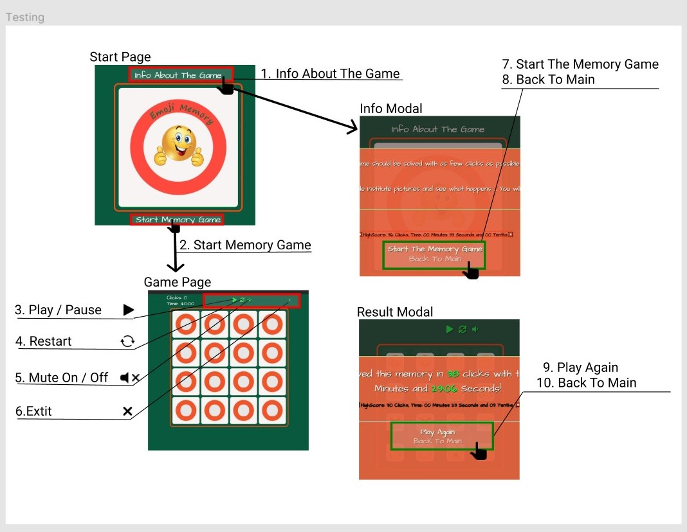
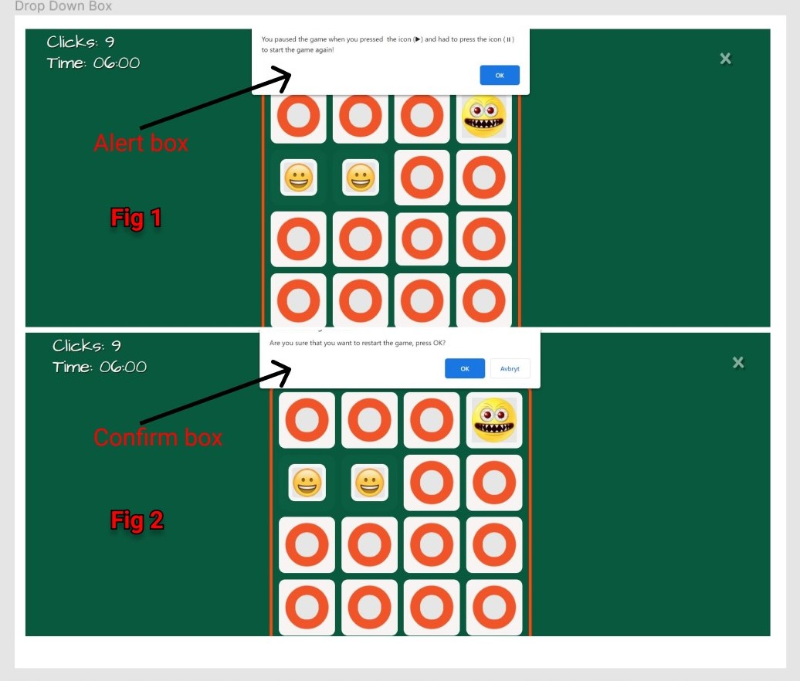

# Testing

[View website in GitHub Pages](https://manell0.github.io/MileStone-2-emoji-memory/index.html)

[GO TO README.md](README.md)

## Table of contents

1. [Testing User Stories](#Testing-User-Stories)
2. [Manual Testing](#Manual-Testing)
3. [Automated Testing](#Automated-Testing)
   1. [Code Validation](#Code-Validation)
   2. [Browser Validation](#HTML-Validation)
   3. [Lighthouse Auditing](#Lighthouse)
4. [User Testing](#User-Testing)

## Testing User Stories

### New/Potential User Goals:

1. As a new user, I want to easily navigate through the website to find the relevant content, effortlessly.

   - The navigation is clearly defined and easily navigable for users to find and use.

2. As a new user, I want to play the classic single game memory.

   - The 'info' and 'game' pages is appropriately named for users wishing to find out about the game.
   - The 'info' and 'game' pages is easily found on each page, no matter the device.

3. As a new user, I Want to easily have the ability to get the rules and criteria of the game.

   - The info Modal that appears when you click on Info About The Game Link explains how the game works, and you can also see your own high score. You can also start the game immediately.

4. As a new user, I Want to easily have the ability to get to the game area and start playing.

   - The game can be started directly from the front page in a very simple way.

5. As a new user, I want some features in the game:

   - [x] I want to be able to turn off the sound.

   - [x] I want to be able to pause the game.

   - [x] I want to be able to restart the game.

   - [x] I want to be able to close the game and get back to the front page.

   - [x] I want to be able to see my best result (click and time).

## Manual Testing

### Elements / Items Testing

#### Start Page

The front page works flawlessly in all screen sizes and is self-explanatory.

1. Info About The Game link:
   - [x] Hover function works. The link goes to the correct URL (Info Modal).
2. Start Memory Game link:
   - [x] Hover function works. The link goes to the correct URL (game.html) and start the game.

#### Game Page

The game page works as expected and no bugs are detected when the game is played. All sounds and buttons / icons work as expected and work in all screen sizes.

3. Play / Pause icon:
   - [x] Hover function works and switches to pause icon when the game is paused.
4. Restart icon:
   - [x] Hover function works and a confirm drop down menu verifies the user's response.
5. Mute On / Off icon:
   - [x] Hover function works and switches to mute off icon when the sound is muted.
6. Exit icon:
   - [x] Hover function works. The link goes to the correct URL (index.html).

#### Info Modal

Info Modal that appears when you click on the front page link (Info About The Game) works as expected and works in all screen sizes.

7. Start The Memory Game:
   - [x] Hover function works. The link goes to the correct URL (game.html) and start the game.
8. Back To Main:
   - [x] Hover function works. The link goes to the correct URL (index.html).

#### Result Modal

The Modal that is automatically displayed when you have completed a game works as expected and works in all screen sizes. You can also see your high score here.

9. Play Again:
   - [x] Hover function works. The link goes to the correct URL (game.html) and start the game.
10. Back To Main:
    - [x] Hover function works. The link goes to the correct URL (index.html).

- All links leads to the right place and no broken links
- All icons, headers and text is on the right place regardless of screen size
- Hover effects on all links
- All functionality in the game is controlled and works satisfactorily
- All Modals are checked and work satisfactorily in all screen sizes

---

#### Fig 1:

- An alert box appears when a user has paused the game and tries to click on the game board.
  - The alert box's warning sound and other functionality work as intended.

#### Fig 2:

- An confirm box appears when a user press the restart icon to confirm whether the user wants to restart the game or not.
  - The confirm box warning sound and other functionality work as intended.

---

## Automated Testing

### code Validation

- The [RESPONSIVE WEB DESIGN CHECKER](https://responsivedesignchecker.com/) service was used to check how responsive the website are.

  - Is also checked with the browser's built-in responsive tool (inspect).

- The [W3C Markup Validator](https://validator.w3.org/) service was used to validate the HTML code used.

- The [W3C CSS Validator](https://jigsaw.w3.org/css-validator/) service was used to validate the CSS code used.

- The [jshint](https://jshint.com/) service was used to validate the JavaScript code used.

- All HTML and CSS pages are formatted using [The formatter](https://www.freeformatter.com/).

- Used [corrector](https://www.corrector.co/) for spell checking.

### HTML Validation

#### Results:

- All pages on the site have the same result. See below.

### CSS Validation

#### Results:

- It´s only one CSS file in the project (style.css)
  - (The test is done from Swedish browser, translated into English: Congratulations! No errors were found)

## Lighthouse

Screenshot from index page (desktop device)

[Lighthouse test as PDF ](assets/readme-resources/lighthouse.pdf)

## User Testing

Corrected and checked with https://www.corrector.co/

Family members were asked to review the site and documentation to point out any bugs and/or user experience issues. Their helpful advice throughout the process led to many UX changes in order to create a better experience.

[Back to the top](#Testing)
