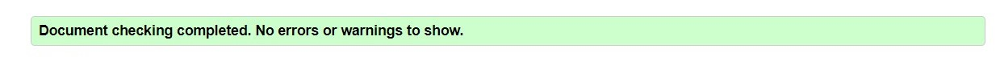
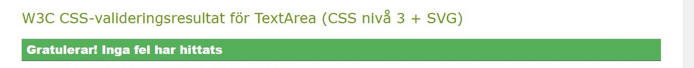
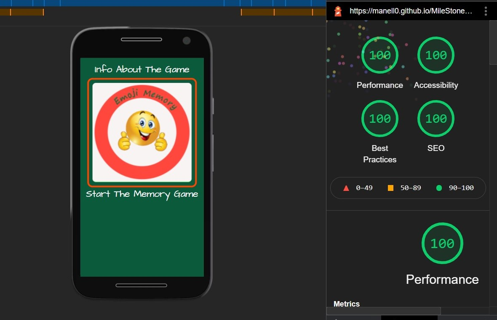

# Testing

[View website in GitHub Pages](https://manell0.github.io/MileStone-2-emoji-memory/index.html)

[GO TO README.md](README.md)

## Table of contents

1. [Testing User Stories](#Testing-User-Stories)
2. [Manual Testing](#Manual-Testing)
3. [Automated Testing](#Automated-Testing)
   1. [Code Validation](#Code-Validation)
   2. [Browser Validation](#HTML-Validation)
   3. [Lighthouse Auditing](#Lighthouse)
4. [User Testing](#User-Testing)

## Testing User Stories

### New/Potential User Goals:

1. As a new user, I want to easily navigate through the website to find the relevant content, effortlessly.

   - The navigation is clearly defined and easily navigable for users to find and use.

2. As a new user, I want to play the classic single game memory.

   - The 'info' and 'game' pages is appropriately named for users wishing to find out about the game.
   - The 'info' and 'game' pages is easily found on each page, no matter the device.

3. As a new user, I Want to easily have the ability to get the rules and criteria of the game.

4. As a new user, I Want to easily have the ability to get to the game area and start playing.

## Manual Testing

### Elements / Items Testing

- All links leads to the right place and no broken links
- All icons, headers and text is on the right place regardless of screen size
- Hover effects on all links
- All functionality in the game is controlled and works satisfactorily
- All Modals are checked and work satisfactorily in all screen sizes

## Automated Testing

### code Validation

- The [W3C Markup Validator](https://validator.w3.org/) service was used to validate the HTML code used.

- The [W3C CSS Validator](https://jigsaw.w3.org/css-validator/) service was used to validate the CSS code used.

- The [jshint](https://jshint.com/) service was used to validate the JavaScript code used.

- All HTML and CSS pages are formatted using [The formatter](https://www.freeformatter.com/).

- Has used [corrector](https://www.corrector.co/) for spell checking.

### HTML Validation

#### Results:

- All pages on the site have the same result. See below.

### CSS Validation

#### Results:

- It´s only one CSS file in the project (style.css)
  - (The test is done from Swedish browser, translated into English: Congratulations! No errors were found)

## Lighthouse

Screenshot from index page (desktop device)

[Lighthouse test as PDF ](assets/readme-resources/lighthouse.pdf)

## User Testing

Family members were asked to review the site and documentation to point out any bugs and/or user experience issues. Their helpful advice throughout the process led to many UX changes in order to create a better experience.

[Back to the top](#Testing)
